# Introduction to Watson Assistant

## Lab 2 - Using slots and server functions

## Overview

This is a continuation of the lab exercise [Building a Watson Assistant chatbot from scratch](https://github.com/djccarew/watson-assistant-from-scratch-lab) that introduces two new important features of Watson Assistant.

1. **Slots** - The slots feature allows you to collect multiple pieces of information in a single Dialog node allowing users to provide  some or all of the required information when interacting with your bot. By changing the DinnerBot chatbot to use slots only one  dialog node is needed and the bot is much more flexible. For example if a user enters `Book a table` as before they will be prompted  in sequence for all  the information needed. However if a user enters `Book a table for Chinese food next Friday at 8pm` the bot will only ask for the number of people dining before confirming the reservation.

2. **IBM Cloud Function integration** - This allows you to define calls to IBM Cloud Functions in Dialog nodes directly so these calls can be made automatically  as opposed to you  having to make those calls yourself in the application that is driving your chatbot. You can test all the  defined  external  calls from the Watson Assistant tooling without having to write any additional code


## Part 1 Building DinnerBot using the slots feature

### Step 1: Import the starting skill

If not open already, navigate to the [Bluemix Console](https://console.bluemix.net/) and launch your IBM Watson Assistant service.

To save time you'll import a skill  as a starting point that has all the DinnerBot intents and entities  already defined.

1. Download the saved Skills file [dinnerbot-slots-begin.json](workspaces/dinnerbot-slots-begin.json) to your local filesystem. (Click "Raw" from the link above to get the raw format to save locally)

2. From the Watson Assistant tooling click on the **Skills** tab and click on **Create new**

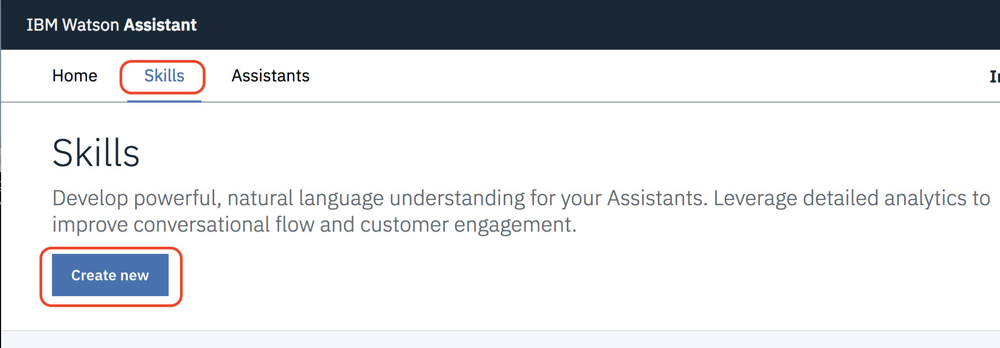

3. Click on **Import skill**, click **Choose JSON file**, select the file ***dinnerbot-slots-begin.json*** and then click **Import**

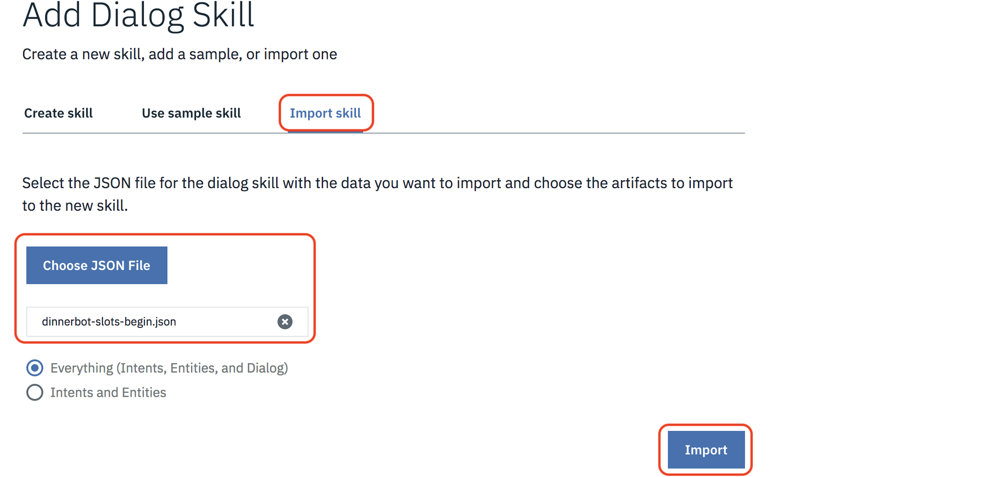

4. The imported skill will open up in the tool. Click on the  **Dialog** tab to start working on it


### Step 2: Add the slots node

1. Select the Welcome node and click **Add node**

2. Name the node *Book Reservation* and select the #book-reservation intent where it says **if assistant recognizes**

3. Click on **Customize** in the top right corner. Select **Enable Slots** and **Prompt for everything**. Click **Apply**

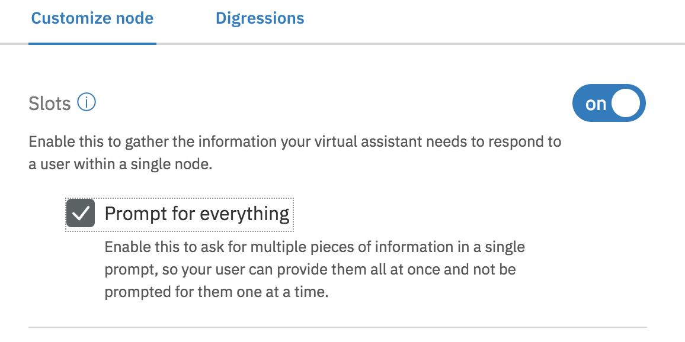

4. Add the first slot by entering `@cuisine`,  in the column labeled **Check for**, `$cuisine` in the **Save it as** column and the  prompt `Which restaurant or what type of cuisine would you like?` in the **If not present, ask** column

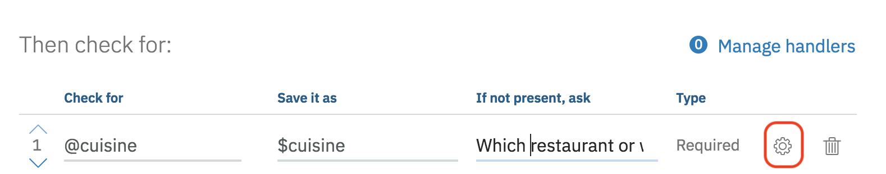

5. Enter `Sure I can help make a reservation. What type of cuisine or which restaurant did you want?` in the field with label **If no slots are pre-filled, ask this first**

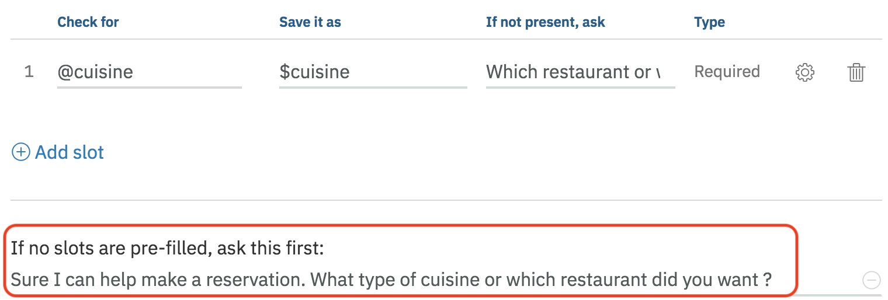

6. Click on the gear icon next to the added slot to add the error handling that was implemented in the original version. Scroll down to the field with label **Not found** and enter `Please enter a valid  cuisine type or restaurant name`
Click **Save**

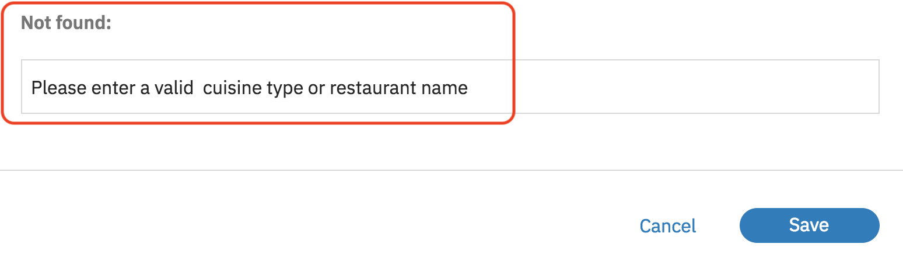

7. Add the following slots one by one by clicking on  **Add slot** prior to adding each one. Remember that you'll need to click on the gear icon next to a slot to add in the  message in the **Not Found** field for that slot.

| Check for        | Save it as   | If not present ask                    | Not found                       |
|------------------|--------------|---------------------------------------|---------------------------------|
| @sys-date        | $date        | `What day would you like to reserve ?`  | `Please enter a valid date`       |
| @sys-time        | $time        | `What time would you like to reserve ?` | `Please enter a valid time`       |
| @sys-number      | $number      | `How many people will be dining?`      | `Please enter a valid party size` |


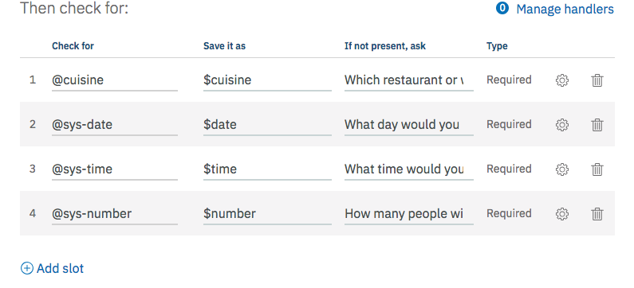

8. Add `Great! I've booked a table for <? $number ?> people on <? $date ?> at <? $time ?> for <? $cuisine ?>` to field with label **Then respond with:**

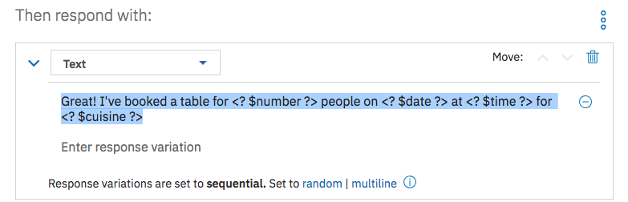

### Step 3: Test your chatbot

The Watson Assistant tooling offers a testing panel to test phrases to confirm the correct intents, entities, and dialog are matched and returned.

1. To test the bot, click on the **Try it** icon in the top-right corner of the tooling.

2. A side panel appears and shows the contents of the node that matches welcome. Enter a message that triggers the #book_reservation intent. Start with  `book a table`

3. Follow the prompts and verify that the chatbot is equivalent to the  version built without slots

4. Click on the **Clear** link to start over with the test tool.  Type `Book a table chinese friday 8pm` when prompted.

5. Verify that you're only prompted for the number of people dining before getting a confirmation message.

6. Click on the **Clear** link to start over with the test tool.  Type `Book a table for 4 mexican  friday 8pm` when prompted.

7. Verify that you get a confirmation message without being prompted for any input.

## Part 2 Call an IBM Cloud Function from a Dialog Node

### Step 1: Creating the IBM Cloud Function

The first step is create a Cloud Function. We've provided a simple one for you that would typically be used in a scenario like this to confirm the reservation once all the details are collected.  Our example just formats the  confirmation message to make it more user friendly but could easily be extended to do more.

1. Go to https://bluemix.net and log in with  your IBM Cloud credentials

2. Click on the 3 line (hamburger) icon at the top left and select **Functions**

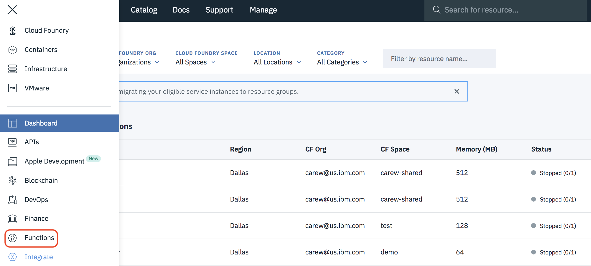

3. Click on **Start creating** and then click on **Create Action**

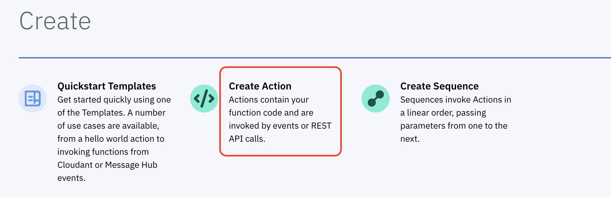

4. Name the action `confirmBooking`, keep the other default values and click **Create**

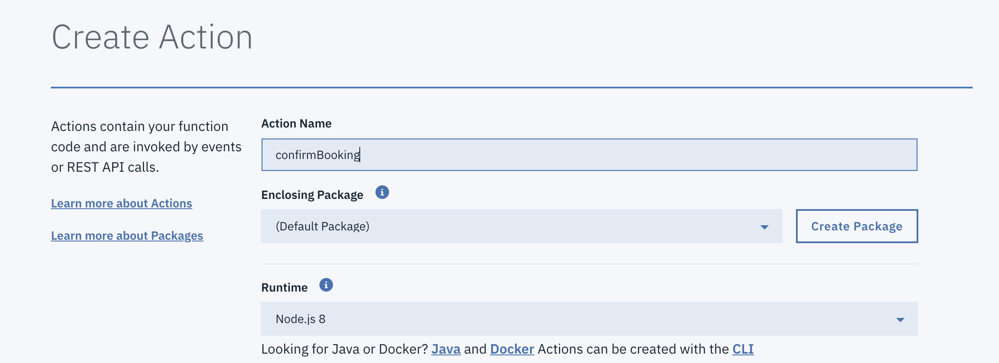

5. In a new browser tab copy the contents of the source file [confirm-booking.js](cloud-functions/confirm-booking.js) to your clipboard

6. Go back the Cloud Function editor and replace the default content of your new Cloud Function with the contents of the clipboard.

7. Click **Save**

8. In the navigation area on the left click on **Endpoints**. Select **Enable as Web Action** and then click **Save**

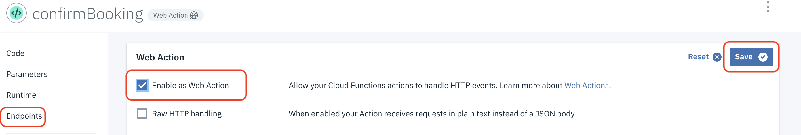

9. In the navigation area on the left click on **Code**. Click **Change Input** and replace the default input parameters with the following:

`{"cuisine":"french","number": "3", "date":"2018-12-08","time":"20:30:00"}`

10. Click **Apply** and then click **Invoke** to test your cloud function. Verify that it returns a formatted message like the one shown below:

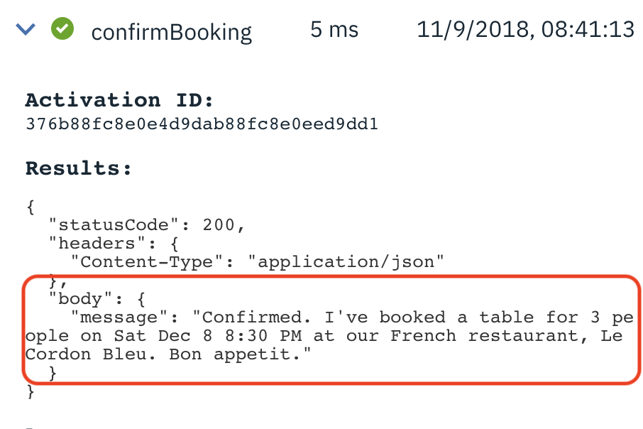

11. In the navigation area on the left click on **Endpoints**. Click on the icon to copy the URL of your cloud function to the clipboard

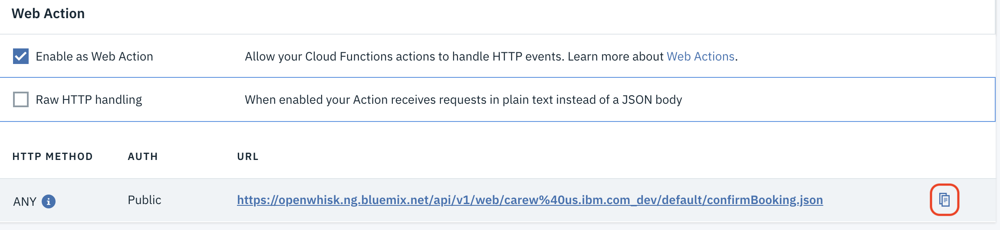

12. Open a text file and paste the URL into it.

### Step 2: Modifying DinnerBot to call the IBM Cloud Function

In this step you'll modify your dialog node that uses slots to call your cloud function to format the final conformation message shown to the user. You can't display the result of a cloud function call in the same node so we'll have to add a child node to display the result of the cloud function call. We also add a second child node to handle any errors returned from the call to the cloud function.

1. Go back to the Watson Assistant tool where you created the slots version of DinnerBot.

2. Select the **Dialog** tab and create 2 child nodes of the **Book Reservation**
 node with the following attributes:

 |  Node name   | If assistant recognizes | Then respond with          |
 |--------------|----------------------------------------------------|----------------------------|
 | Confirmation | `$confirmation.cloud_functions_call_error == null` | `<? $confirmation.body.message ?>`|
 | Cloud Function Error | anything_else | `IBM Cloud Function error:  <? $confirmation.cloud_functions_call_error ?>` |

 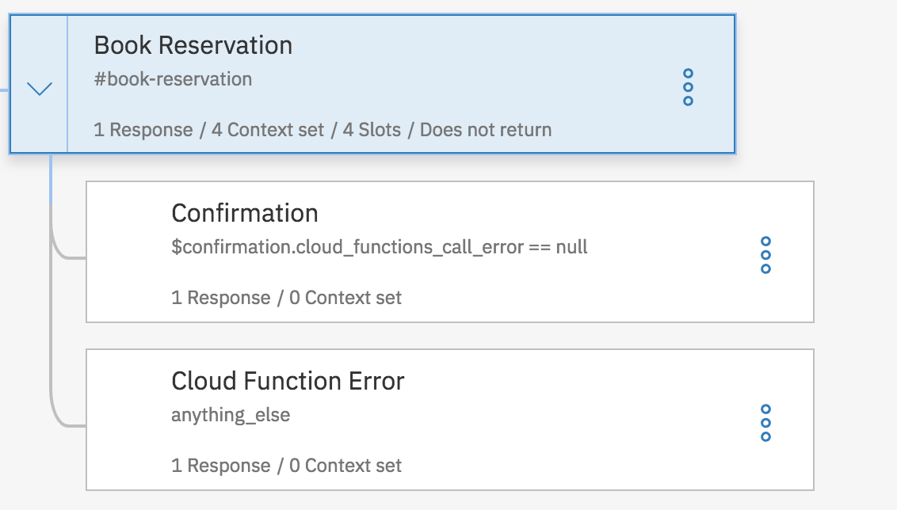

 3. Select the **Book Reservation**. Change the text in the section **Then respond with:** to `Confirming your reservation ...`

 4. In the **And finally** section select **Jump to ...**  and then select the **Confirmation** node. Select the option **If assistant recognizes (condition)**

 5. Click on the 3 dots to the right of **Then respond with:** and select **Open JSON editor** from the context menu

  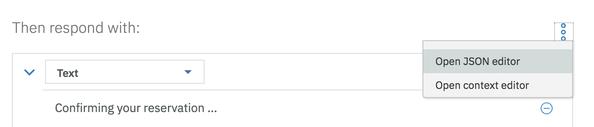

 6. Paste the following code right before the final closing brace:

 ```
 ,
 "actions": [
    {
      "name":"changeme",
      "type":"web_action",
      "parameters": {
        "cuisine":"$cuisine",
        "date":"$date",
        "time":"$time",
        "number":"$number"
      },
      "result_variable": "$confirmation"
    }
  ]
  ```
7. Go to the text file where you saved your cloud function's URL and copy the part right after the prefix `https://openwhisk.ng.bluemix.net/api/v1/web` to the
clipboard. For example if your URL looks like this:

`https://openwhisk.ng.bluemix.net/api/v1/web/johndoe_dev/default/confirmBooking.json`

You would copy this:

`/johndoe_dev/default/confirmBooking.json`

8. Back in the Watson Assistant tool replace the value of the **name** attribute with the contents of the  clipboard. The added JSON should now look something like this:

```
,
"actions": [
   {
     "name":"/johndoe_dev/default/confirmBooking.json",
     ...
```
### Step 3: Test the Cloud Function from the Watson Assistant test tool

1. In the Watson Assistant test tool click on the **Clear** link to start over. Type `Book a table for 4 mexican friday 8pm` when prompted.

2. Verify that you get a formatted confirmation message without being prompted for any input.  

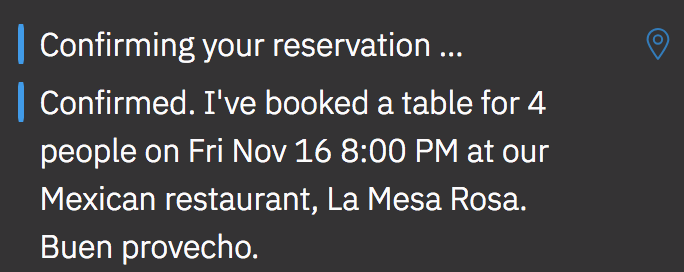

## Summary

The slots feature of Watson Assistant service greatly simplified the process of  gathering multiple required pieces of information.

The Cloud Function integration enabled calling external services from within Watson Assistant so the logic in the driving application can be simplified significantly.
